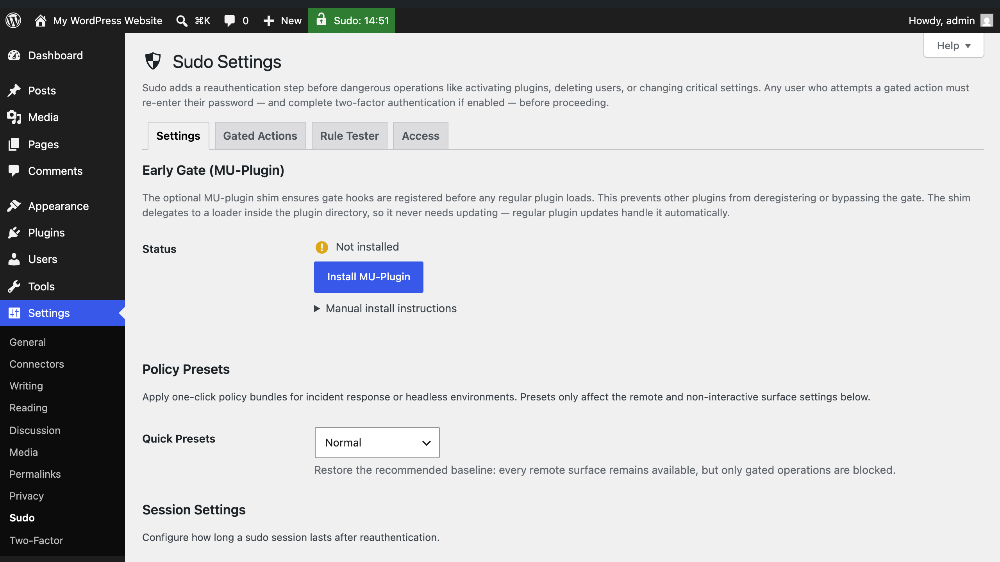
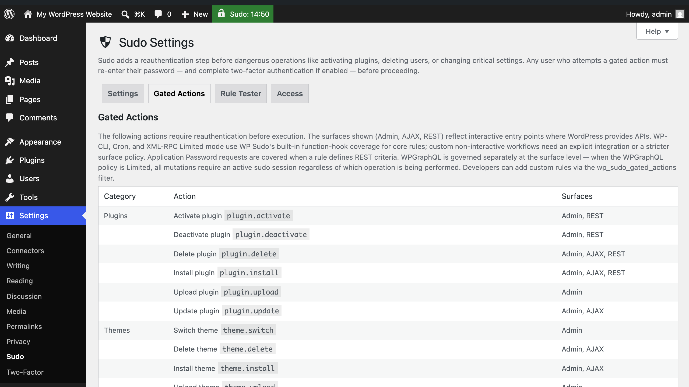
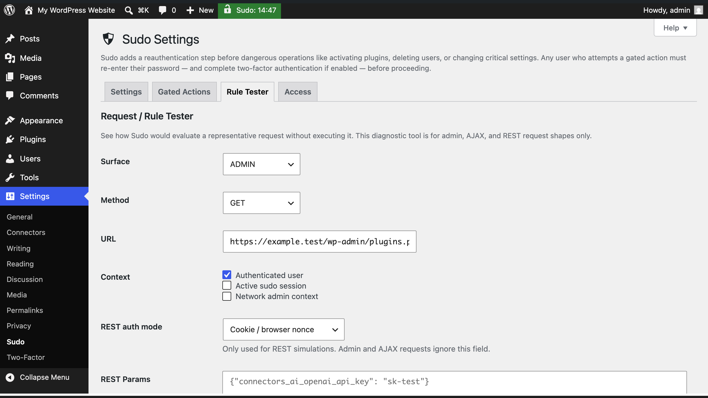
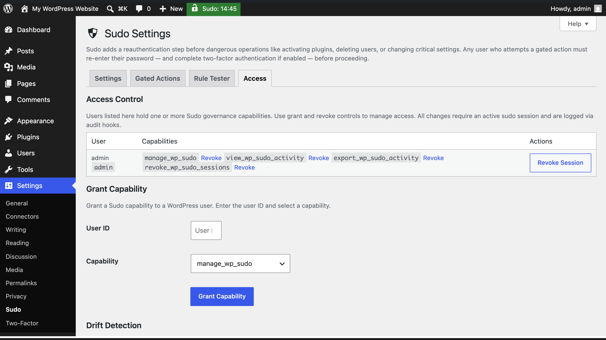
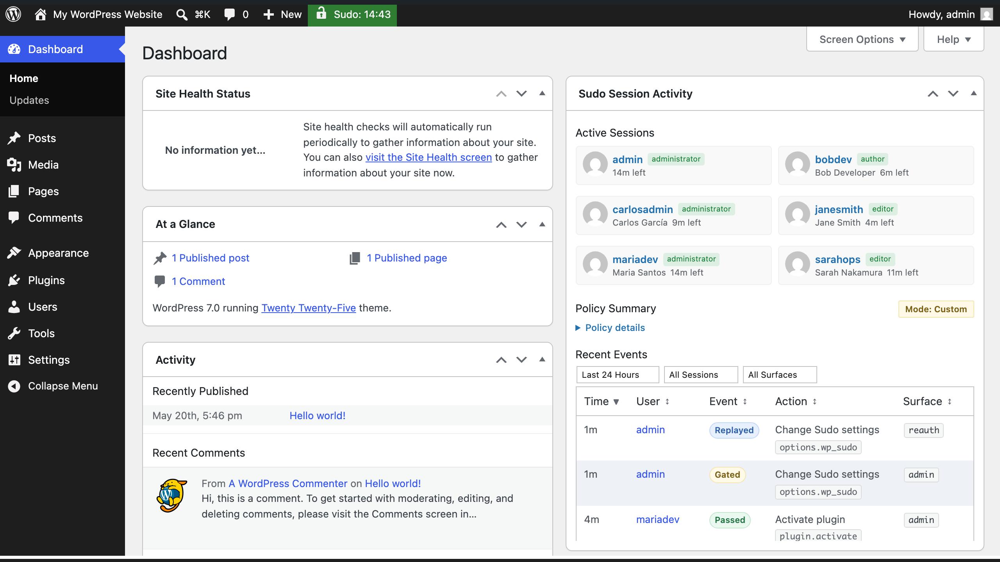
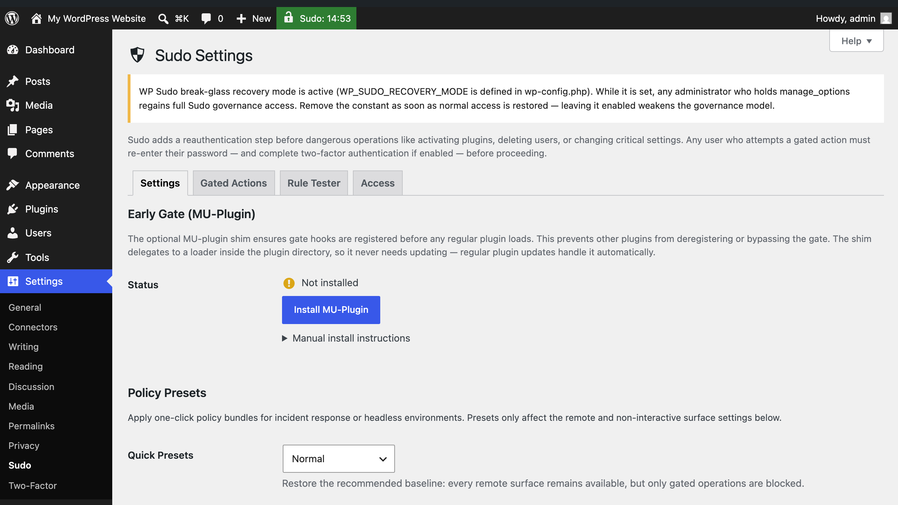

# WP Sudo

Require password confirmation before high-risk changes go through on your WordPress site — even from an already-authenticated admin session.

[](https://spdx.org/licenses/GPL-2.0-or-later.html)
[](https://wordpress.org/)
[](https://www.php.net/)
[](https://github.com/dknauss/Sudo/actions/workflows/phpunit.yml)
[](https://github.com/dknauss/Sudo/actions/workflows/psalm.yml)
[](https://github.com/dknauss/Sudo/actions/workflows/e2e.yml)
[](https://github.com/dknauss/Sudo/actions/workflows/codeql.yml)
[](https://codecov.io/gh/dknauss/Sudo)
[](https://shepherd.dev/github/dknauss/Sudo)
[](https://playground.wordpress.net/?blueprint-url=https%3A%2F%2Fraw.githubusercontent.com%2Fdknauss%2FSudo%2Fv3.4.0%2Fblueprint.json)
[](https://playground.wordpress.net/?blueprint-url=https%3A%2F%2Fraw.githubusercontent.com%2Fdknauss%2FSudo%2Fmain%2Fblueprint-main.json)

Playground demo credentials are `admin` / `password`. When WP Sudo asks for reauthentication, enter the same password: `password`.

## Screenshots














## Features

- **Confirmation before destructive actions** — plugin installs/deletions, user management, settings changes, core updates, and more all require a fresh password before proceeding
- **Two-factor support** — integrates with the [Two Factor plugin](https://wordpress.org/plugins/two-factor/) so the challenge includes your second factor when active
- **Short sudo window** — one confirmation covers 1–15 minutes of related work (your choice); no repeated prompts for a burst of activity
- **Per-surface policies** — configure WP-CLI, Cron, XML-RPC, REST App Passwords, and WPGraphQL independently as Disabled, Limited, or Unrestricted
- **Governance controls** — manage which users and roles can administer WP Sudo settings via a dedicated Access tab
- **Activity visibility** — audit hooks fire on every gated event; works with WP Activity Log, Stream, and similar plugins
- **Multisite support** — network-aware; super admins governed separately from per-site admins

## Quick start

1. Install and activate WP Sudo.
2. Go to **Settings → Sudo**.
3. Choose a session duration.
4. Review the default policies for non-interactive surfaces.
5. Optionally install the bundled mu-plugin loader from the settings page for earlier hook registration.
6. Test a covered action such as plugin activation or a protected settings change.

### Recommended companion plugins

- [Two Factor](https://wordpress.org/plugins/two-factor/) — strongly recommended for password + second-factor challenge flows.
- [WP Activity Log](https://wordpress.org/plugins/wp-security-audit-log/) or [Stream](https://wordpress.org/plugins/stream/) — recommended if you want audit visibility from WP Sudo's action hooks.

## What gets protected

WP Sudo gates built-in operations across categories including:
- plugin and theme installation, activation, and deletion
- user creation, deletion, and role changes
- file editor access
- critical option changes
- WordPress core updates
- export flows
- WP Sudo settings themselves
- selected Multisite network actions
- connector credential writes via the REST settings endpoint

For the full rule list and surface counts, see [docs/current-metrics.md](docs/current-metrics.md).

## Why it helps

WordPress has roles and capabilities, but no native way to say "a logged-in session alone isn't enough for this action." WP Sudo adds that layer. It's most effective against:

- a stolen or shared browser session
- an unattended, still-authenticated browser
- automated requests through REST, CLI, or XML-RPC that shouldn't bypass human confirmation

Active sudo is **per browser session**, not site-wide. WP Sudo works alongside your existing roles — it does not replace them.

## How it works

**Browser (wp-admin):** gated actions redirect to a challenge screen. After successful reauthentication, the original request replays automatically.

**AJAX and REST:** blocked requests receive a `sudo_required` error until reauthentication occurs.

**Non-interactive surfaces** (WP-CLI, Cron, XML-RPC, REST App Passwords, WPGraphQL): each can be set independently to Disabled, Limited, or Unrestricted under Settings → Sudo.

WP Sudo gates specific operations on specific surfaces. It is not a firewall, exploit detector, or fix for authorization vulnerabilities inside third-party plugin code.

## Sudo administration and governance

"With great power comes great responsibility," so users with the capability to change Sudo settings, view sudo session activity, kill sudo sessions, or export sudo activity logs are limited by default:

- On **single sites**, the installing administrator receives all four caps. Other admins receive none until explicitly granted.
- On **multisite networks**, super administrators receive all four caps at network scope by default. Per-site admins receive none until explicitly delegated.

(Export privileges are separated from view privileges because a portable export artifact is a distinct governance concern — SOC2/GDPR audits treat "can read" and "can take a copy offsite" differently.)

WP Sudo integrates with the **Site Health** tool in WordPress core for rich security diagnostics and advisory notifications.

### Break glass recovery scenario

In a lost, last administrator scenario where no one has access to Sudo's settings, the break-glass mechanism is to set `WP_SUDO_RECOVERY_MODE` in `wp-config.php`. It requires filesystem access to activate, so it is not a remote-escalation vector. The grant is **role-gated**: while the constant is defined, the current user receives the master `manage_wp_sudo` capability only if they also hold `manage_options` (single-site) / `manage_network_options` (multisite), so a locked-out administrator recovers while non-admins gain nothing. A permanent non-dismissible notice appears on the Sudo settings screen while it is active, and the `wp_sudo_recovery_mode_active` audit hook fires so the usage is logged. The role gate does not eliminate the residual risk — every administrator regains full Sudo governance while the constant is set — so remove it the moment normal access is restored.

## For developers and integrators

WP Sudo exposes a small, stable API. Custom gated rules are plain associative arrays registered via the `wp_sudo_gated_actions` filter, with per-surface matchers for admin, AJAX, REST, and CLI. The `wp_sudo_can()` helper centralizes all governance checks — super-admin short-circuit, recovery-mode bypass, and strict/compatibility mode — so integrations don't touch capability internals directly. Audit hooks fire on every session event, capability grant or revoke, tamper detection, and policy change; bridge classes for WP Activity Log and Stream are bundled. The `wp_sudo_grant_session_on_login` filter lets SSO and kiosk integrations suppress the automatic browser-login session grant. All of this is covered by a dual-layer test suite (unit tests + a full integration matrix) and PHPStan level 6.

## Requirements

- **WordPress:** 6.2+
- **PHP:** 8.0+
- **Multisite:** supported

For current release posture, supported lanes, and forward `main` notes, see [docs/release-status.md](docs/release-status.md).

## Documentation

### Start here
- [docs/security-model.md](docs/security-model.md) — threat model, boundaries, and environmental assumptions
- [docs/FAQ.md](docs/FAQ.md) — practical questions and operational caveats
- [docs/release-status.md](docs/release-status.md) — current stable release state and forward-lane posture

### For developers and integrators
- [docs/developer-reference.md](docs/developer-reference.md) — hooks, filters, custom rule structure, and integration API details
- [docs/two-factor-integration.md](docs/two-factor-integration.md) — Two Factor integration behavior
- [docs/connectors-api-reference.md](docs/connectors-api-reference.md) — connector credential gating notes
- [docs/ai-agentic-guidance.md](docs/ai-agentic-guidance.md) — AI and agent tooling guidance

### Verification and project status
- [tests/MANUAL-TESTING.md](tests/MANUAL-TESTING.md) — manual verification procedures
- [docs/current-metrics.md](docs/current-metrics.md) — canonical current counts and architectural facts
- [docs/ROADMAP.md](docs/ROADMAP.md) — roadmap and backlog
- [CHANGELOG.md](CHANGELOG.md) — release history

### Background and research
- [docs/sudo-architecture-comparison-matrix.md](docs/sudo-architecture-comparison-matrix.md) — comparison with other sudo/reauth approaches
- [docs/abilities-api-assessment.md](docs/abilities-api-assessment.md) — WordPress Abilities API assessment
- [docs/core-action-gate-proposal.md](docs/core-action-gate-proposal.md) — longer-form core proposal and design thinking
- [docs/llm-lies-log.md](docs/llm-lies-log.md) — verification discipline and past documentation failures
- [docs/project-introduction.md](docs/project-introduction.md) — the longer conceptual introduction, graphic, poem, and gate metaphor preserved from the earlier README

## Development

Quick local checks:

```bash
composer install
composer test:unit
composer lint
composer analyse
```

For full setup, integration tests, E2E workflows, and contributor expectations, see [CONTRIBUTING.md](CONTRIBUTING.md).

## License

GPL-2.0-or-later.
